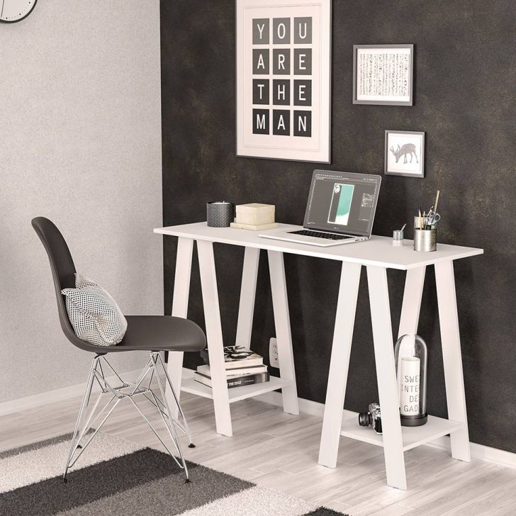
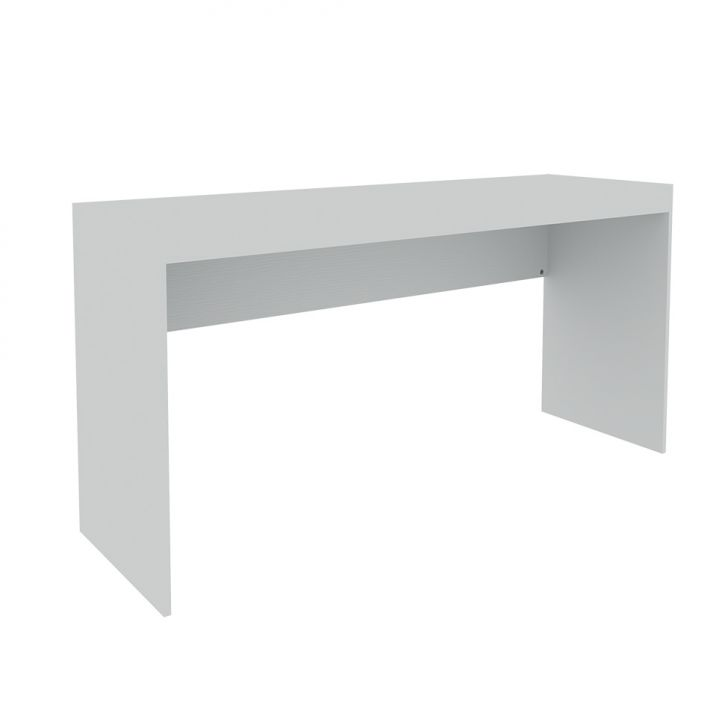

Essa escrivaninha suspensa é ideal para pôr na sala, pois possui espaço para adicionar suporte para televisão, espaço para pôr o notebook e outros compartimentos que cabem perfeitamente sua impressora, livros e até telefone, como mostrado no exemplo. A cor branca na escrivaninha deixa-a combinando com qualquer móvel da sala.

A escrivaninha acima é recomendada para colocar em quartos ou no próprio escritório. Possui um design muito elegante que combina com a maioria dos móveis. Possui 2 gavetas, sendo uma menorzinha que possui um espaço livre em cima, e a outra gaveta possui um espaço maior. Ideal para guardar fichários ou materiais de tamanho médio para grande. 

Ela possui opções de duas cores, sendo uma na cor branca e outra na cor marrom.

**Escrivaninha moderna, cor branca e gaveta larga.**
Se você tá precisando de uma escrivaninha mais simples, mas que ao mesmo tempo muito elegante, eu recomendo escolher a da foto abaixo.

Ela possui um estilo bem minimalista, possuindo apenas uma gaveta larga e uma superfície lisa perfeita para pôr o seu notebook e materiais de papelaria.

Serve para escrever, desenhar e usar o computador.

**Escrivaninha moderna, design elegante de cor branca.**

Dependendo do ambiente que você estiver montando, esta escrivaninha estilo hipster abaixo pode combinar muito com seu ambiente.

O design moderno com pernas no estilo mesa traz um diferencial para seu quarto, sala ou escritório.

Há espaço para você decorar com livros ou plantas, que dá um visual bem natural e aconhegante.

**Escrivaninha branca com duas gavetas largas**

Este tipo de escrivaninha que você está vendo abaixo serve muito bem para usar com o computador. 

Isto porque o espaço largo embaixo da escrivaninha permite que você deixe suas pernas à vontade quando estiver sentado.

É muito ruim a sensação de não poder as pernas depois de estar sentado por um tempo, concorda?

Portanto, se não quiser ter esse problema, a escrivaninha abaixo é ideal para você.

**Escrivaninha branca com duas gavetas laterais**

Na minha opinião esta escrivaninha combina perfeitamente para você usar com computador desktop, apesar da foto estar com um notebook como exemplo.

Isto porque é possível posicionar o monitor em cima da mesa e botar a cpu no chão abaixo da escrivaninha.

As gavetas e espaçamento ao lado servem para dar suporte na organização.

Portanto se você precisa de uma escrivaninha para computador considere escolher a opção abaixo.

**Escrivaninha minimalista. Branca, simples e elegante**

Você está em busca de uma escrivaninha espaçosa?

Esta mesa abaixo pode ser o que você precisa.

Ela possui uma largura tão boa que eu até já imagino uma decoaração para ela:

Você pode posicionar seu notebook em cima, decorar com fotos, organizadores de lápis e canetas e ainda colocar uma plantinha.

Vai ficar muito elegante no seu quarto ou escritório.

**Escrivaninha branca compacta para quartos pequenos**

Muito charme para pouco tamanho, ou melhor. Muito chame para o tamanho ideal!

Se você possui um quarto pequeno e está em busca de uma escrivaninha com tamanho compacto, talvez não precise mais ficar buscando.

A escrivaninha exibida a seguir possui um design bem atraente e com espaço suficiente para colocar o seu notebook.

Ainda possui um espaçozinho em baixo, muito úteis para guardar materiais que usamos constantemente quando estamos no computador.

Além do mais, ela possui rodinhas que facilitam sua locomoção no quarto ou escritório.

**Escrivaninha branca, suspensa, com compartimentos para impressora livros e decoração**

Às vezes as versões pequenas não são suficientes para o tanto de coisas que temos para guardar no nosso quarto ou escritório.

Pensando nisso, trouxemos na lista uma escrivaninha estilo suspensa da cor branca com basntante compartimentos para organização.

Precisando de muito espaço para guardar materiais de escritório ─ que você pode entender como material de estudo ou trabalho ─ pode escolher a escrivaninha abaixo sem arrependimento.

**Escrivaninha para computador com 4 gavetas**

Tal como bem ilustrada na foto, a escrivaninha abaixo é perfeita se você pretende usar como mesa para computador.

Isso porque seu espaço é perfeito para apoiar o monitor, teclado e mouse.

O CPU pode ficar no chão, abaixo, como ilustrado na foto.

Seu design com gavetas que possuem hastes que parecem de metal combinam com as estruturas do computador, trazendo uma unidade para o visual do seu escritório.

Outra vantagem desse modelo é que possui 4 gavetas, profundas e com espaço suficiente para guardar bastante material de escritório, administração.

**Escrivaninha marrom claro com duas gavetas e espaço extra**
Se ao invés de computador você possuir notebook mas ainda assim estiver em busca de uma opção com gavetas, o modelo abaixo pode servir para você.

A foto de exemplo abaixo mostra como pode ficar elegante o design com poucos itens sobre à mesa.

Além de duas gavetas com profundidade razoável, há um espaço livre abaixo para guardar fichários, livros ou usar como decoração.

**Escrivaninha marrom claro com gavetas laterais**

Esta escrivaninha cor de madeira marrom claro possui um design diferente das que encontramos normalmente com gavetas lateriais.

Isto porque seu espaço lateral é dividido entre gavetas e espaços vazios, que além de trazer um visual diferente, também facilita na organização.

Você pode deixar nesses espaços vazios os itens que usa com mais frequência enquanto está estudando / trabalhando.

Assim fica mais fácil de pegar os itens e depois do uso devolvê-los para o seu lugar.

Também é possível usar como espaço de apoio caso esteja utilizando todo o espaço da superfície da mesa.

**Escrivaninha compacta com rodinhas ideal para quartos pequenos**

Nem sempre o maior é a melhor opção.

Dependendo do tamanho que você tem disponível e também dos outros móveis que compõem seu escritório (ou quarto), talvez a melhor opção seja comprar uma escrivaninha pequena.

A opção abaixo é compacta e possui tamanho suficiente para apoiar seu notebook.

Alguns usos alternativos para o modelo de escrivaninha abaixo é:

  - Utilizar como suporte para itens de decoração
  - Usar como escrivaninha secundária para livros
  - Usado para apoiar o monitor ou televisão

Como este modelo possui rodinhas, eu vejo como uma boa opção para pôr seu monitor.

Dessa forma você pode movê-lo para ver filmes antes de dormir. E na hora de trabalhar ou estudar move para perto do computador.

