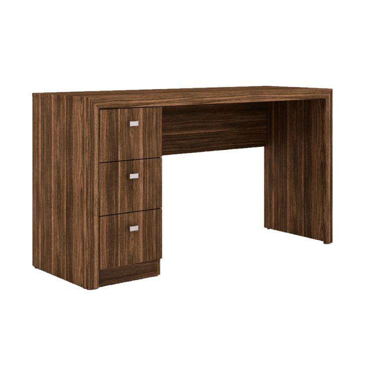

Tabela de conteúdo <a href="javascript:;" id="toc__toggler">[exibir/ocultar]</a>

* TOC
{: toc }
{: .table-of-content }

### Escrivaninha suspensa cor branca 

Essa escrivaninha suspensa é ideal para pôr na sala, pois possui espaço para adicionar suporte para televisão, espaço para pôr o notebook e outros compartimentos que cabem perfeitamente sua impressora, livros e até telefone, como mostrado no exemplo. A cor branca na escrivaninha deixa-a combinando com qualquer móvel da sala.

### Escrivaninha com duas gavetas cor madeira

A escrivaninha abaixo é recomendada para colocar em quartos ou no próprio escritório. Possui um design muito elegante que combina com a maioria dos móveis. Possui 2 gavetas, sendo uma menorzinha que possui um espaço livre em cima, e a outra gaveta possui um espaço maior. Ideal para guardar fichários ou materiais de tamanho médio para grande. 

Ela possui opções de duas cores, sendo uma na cor branca e outra na cor marrom.

### Escrivaninha moderna, cor branca e gaveta larga

Se você tá precisando de uma escrivaninha mais simples, mas que ao mesmo tempo muito elegante, eu recomendo escolher a da foto abaixo.

Ela possui um estilo bem minimalista, possuindo apenas uma gaveta larga e uma superfície lisa perfeita para pôr o seu notebook e materiais de papelaria.

Serve para escrever, desenhar e usar o computador.

### Escrivaninha moderna, design elegante de cor branca

Dependendo do ambiente que você estiver montando, esta escrivaninha estilo hipster abaixo pode combinar muito com seu ambiente.

O design moderno com pernas no estilo mesa traz um diferencial para seu quarto, sala ou escritório.

Há espaço para você decorar com livros ou plantas, que dá um visual bem natural e aconhegante.

### Escrivaninha branca com duas gavetas largas

Este tipo de escrivaninha que você está vendo abaixo serve muito bem para usar com o computador. 

Isto porque o espaço largo embaixo da escrivaninha permite que você deixe suas pernas à vontade quando estiver sentado.

É muito ruim a sensação de não poder as pernas depois de estar sentado por um tempo, concorda?

Portanto, se não quiser ter esse problema, a escrivaninha abaixo é ideal para você.

### Escrivaninha branca com duas gavetas laterais

Na minha opinião esta escrivaninha combina perfeitamente para você usar com computador desktop, apesar da foto estar com um notebook como exemplo.

Isto porque é possível posicionar o monitor em cima da mesa e botar a cpu no chão abaixo da escrivaninha.

As gavetas e espaçamento ao lado servem para dar suporte na organização.

Portanto se você precisa de uma escrivaninha para computador considere escolher a opção abaixo.

### Escrivaninha minimalista. Branca, simples e elegante

Você está em busca de uma escrivaninha espaçosa?

Esta mesa abaixo pode ser o que você precisa.

Ela possui uma largura tão boa que eu até já imagino uma decoaração para ela:

Você pode posicionar seu notebook em cima, decorar com fotos, organizadores de lápis e canetas e ainda colocar uma plantinha.

Vai ficar muito elegante no seu quarto ou escritório.

### Escrivaninha branca compacta para quartos pequenos

Muito charme para pouco tamanho, ou melhor. Muito chame para o tamanho ideal!

Se você possui um quarto pequeno e está em busca de uma escrivaninha com tamanho compacto, talvez não precise mais ficar buscando.

A escrivaninha exibida a seguir possui um design bem atraente e com espaço suficiente para colocar o seu notebook.

Ainda possui um espaçozinho em baixo, muito úteis para guardar materiais que usamos constantemente quando estamos no computador.

Além do mais, ela possui rodinhas que facilitam sua locomoção no quarto ou escritório.

**Escrivaninha branca, suspensa, com compartimentos para impressora livros e decoração**

Às vezes as versões pequenas não são suficientes para o tanto de coisas que temos para guardar no nosso quarto ou escritório.

Pensando nisso, trouxemos na lista uma escrivaninha estilo suspensa da cor branca com basntante compartimentos para organização.

Precisando de muito espaço para guardar materiais de escritório ─ que você pode entender como material de estudo ou trabalho ─ pode escolher a escrivaninha abaixo sem arrependimento.

**Escrivaninha para computador com 4 gavetas**

Tal como bem ilustrada na foto, a escrivaninha abaixo é perfeita se você pretende usar como mesa para computador.

Isso porque seu espaço é perfeito para apoiar o monitor, teclado e mouse.

O CPU pode ficar no chão, abaixo, como ilustrado na foto.

Seu design com gavetas que possuem hastes que parecem de metal combinam com as estruturas do computador, trazendo uma unidade para o visual do seu escritório.

Outra vantagem desse modelo é que possui 4 gavetas, profundas e com espaço suficiente para guardar bastante material de escritório, administração.

**Escrivaninha marrom claro com duas gavetas e espaço extra**

Se ao invés de computador você possuir notebook mas ainda assim estiver em busca de uma opção com gavetas, o modelo abaixo pode servir para você.

A foto de exemplo abaixo mostra como pode ficar elegante o design com poucos itens sobre à mesa.

Além de duas gavetas com profundidade razoável, há um espaço livre abaixo para guardar fichários, livros ou usar como decoração.

**Escrivaninha marrom claro com gavetas laterais**

Esta escrivaninha cor de madeira marrom claro possui um design diferente das que encontramos normalmente com gavetas lateriais.

Isto porque seu espaço lateral é dividido entre gavetas e espaços vazios, que além de trazer um visual diferente, também facilita na organização.

Você pode deixar nesses espaços vazios os itens que usa com mais frequência enquanto está estudando / trabalhando.

Assim fica mais fácil de pegar os itens e depois do uso devolvê-los para o seu lugar.

Também é possível usar como espaço de apoio caso esteja utilizando todo o espaço da superfície da mesa.

**Escrivaninha compacta com rodinhas ideal para quartos pequenos**

Nem sempre o maior é a melhor opção.

Dependendo do tamanho que você tem disponível e também dos outros móveis que compõem seu escritório (ou quarto), talvez a melhor opção seja comprar uma escrivaninha pequena.

A opção abaixo é compacta e possui tamanho suficiente para apoiar seu notebook.

Alguns usos alternativos para o modelo de escrivaninha abaixo é:

  - Utilizar como suporte para itens de decoração
  - Usar como escrivaninha secundária para livros
  - Usado para apoiar o monitor ou televisão

Como este modelo possui rodinhas, eu vejo como uma boa opção para pôr seu monitor.

Dessa forma você pode movê-lo para ver filmes antes de dormir. E na hora de trabalhar ou estudar move para perto do computador.

**Escrivaninha rústica com 3 gavetas**

Se você é um apaixonado pelo estilo rústico e adora essas coloração forte de madeira, a escrivaninha abaixo vai te agradar e muito.

Ela tem uma cor de marrom forte, com as marcas de madeira à mostra, que combinam com ambientes que já estão decorados neste estilos.

A escrivaninha rústica abaixo possui 3 gavetas para deixar seus materiais organizados.

**Escrivaninha em L (de canto) com armário e duas gavetas**

A escrivainha em L, também conhecida como escrivaninha de canto, é uma das mais procuradas na internet e está em grande tendência.

Uma das maiores vantagens da escrivaninha no formato L é o espaço extra que se ganha com a bancada extra.

Esse ganho de espaço extra não interfere no seu ambiente atual, pois um dos melhores uso para ela é posicioná-la no canto do quarto (ou escritório).

Além disso o espaço que sobra embaixo dá pra botar a CPU do computador como demonstrado na foto.

Portanto eu diria que essa é uma boa **mesa para computador**

A escrivaninha de canto é ideal se você pretende apoiar múltiplos itens de uma só vez.

As 3 gavetas ao lado permitem uma organização para troca rápidas de periféricos para uso.

Por exemplo, uma maneira de organizar é ter uma gaveta para guardar só os eletrônicos: fones de ouvido, pilhas para o mouse, tablet ou mesa digitalizadora, etc.

Assim você escolhe o item que quer usar no momento e após o uso volta a guardar no seu local, deixando tudo em cima da mesa organizado e espaço suficiente para seu computador ou notebook. 

Com a escrivaninha em L você tem espaço suficiente para colocar notebook, monitor extra, impressora, organizadores de papel, organizores de lápis e canetas, luminárias, mesas digitais, tablet ou celular. 

Só precisa organizar direito cada um deles e reversar a ocupação na mesa para não se tornar uma bagunça.

**Escrivaninha com estante. Estilo pallet, moderna e hispter**

Esta escrivaninha tem um design e cor parecidos com os móveis construídos com pallet, um estilo que está bastante popular atualmente.

Pelo jeito que foi projetada, ela parece um estilo DIY, que também está sendo adotado pelo pessoal na internet.

Mesmo com um design minimalista, a projeção inteligente fez com que houvesse um espaço nesta escrivaninha para guardar periféricos e livros.

Para complementar o espaço a escrivaninha é acompanhada de uma estante no mesmo estilo que decora o ambiente e ajuda na organização.

Designers, ilustradores, escritores e músicos costumam gostar deste estilo mais hipster e naturalista.

**Escrivaninha moderna com dois andares**

Outra opção de escrivaninha moderna e hipster é a desta foto logo abaixo.

Veja como é projetada esta mesa e como ela lembra um pouco um piano?

Eu não sei se os designers criaram ela pensando na referência do piano, mas devido esta impresão que dá, eu recomendaria este modelo para músicos pianistas e tecladistas.

Uma coisa para tomar cuidado com este modelo é só o espaço para guardar coisas.

Como ela não possui gavetas fica difícil de separar cada coisa em seu lugar. Mas caso tenha gostado deste design, uma opção sempre é comprar um armário complementar.

A organização (para músicos) desta escrivaninha seria o notebook na parte de baixo e os caixas de som no 'primeiro andar' para direcionar o som aos ouvidos.

**Escrivaninha formato padrão com duas gavetas e um armário**

Nesta lista mostramos uma escrivaninha no formato L que possuia também duas gavetas e um armário separado.

A versão abaixo possui as mesmas características contanto que o formato dela é o padrão.

Caso você não tenha um espaço para escrivaninha em L, pode também ter uma opção com armários e gavetas no formato padrão.

A cor desta escrivaninha combina com móveis de cor mais clara.

**Escrivaninha com baú ideal para guardar livros**

Poderiamos chamar o modelo de escrivaninha abaixo de formato L?

Talvez sim, mas levando em consideração que o balcão extra possui um espaço reduzido.

Ela possui um baú lateral pequeno que não é tão comprido mas serve para guardar livros e pôr objetos em cima.

É um modelo ideal para quem tem um espaço reduzido mas precisa de algum lugar para organizar papéis.

